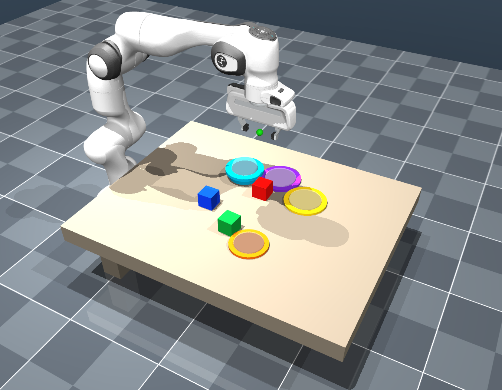

# Language_conditioed_RL

> Ongoing project: multi-task language-conditioned reinforcement learning for robotic pick-and-place.

This repository trains a PPO policy for a simulated Franka Panda robot. A user
prompt selects the block and destination, and the policy is conditioned on that
task while learning reach, grasp, lift, transport, place, release, and settle
behavior.

The RL action is continuous and real: end-effector translation, wrist rotation,
and gripper command. The policy must learn when to approach, close, lift,
transport, lower, release, and settle the block.

## Environment



The scene is a CALVIN-style MuJoCo tabletop setup with:

- real Franka Panda joints, meshes, gripper tendon, contacts, and gravity compensation
- fixed scene camera and wrist camera
- randomized colored block and target placements
- goal-conditioned tasks such as `put the red block in the yellow plate`
- staged PPO curriculum: reach -> grasp -> lift -> transport -> place/release
- protected best-checkpoint saving so later PPO drift does not overwrite the best policy

## Repository Layout

```text
assets/                         project images and media
scripts/                        training, evaluation, and demo launchers
src/language_conditioned_rl/    environment, PPO, and language parser
third_party/calvin_franka_scene MuJoCo Franka scene and robot assets
```

Generated checkpoints, videos, logs, and renders are intentionally ignored by
Git so the repository stays clean.

## Installation

Create and activate a Python environment, then install the dependencies:

```bash
pip install -r requirements.txt
```

For editable development:

```bash
pip install -e .
```

## Quick Check

Render the scene and verify that the environment steps correctly:

```bash
python scripts/smoke_test.py
```

The rendered camera images are saved under `renders/`.

## Training

Start PPO training:

```bash
python scripts/train.py
```

Or use the launcher:

```bash
./scripts/start_training.sh
```

Useful long-run command:

```bash
./scripts/start_training.sh > train_latest.log 2>&1
tail -f train_latest.log
```

Checkpoints are saved under `checkpoints/`.

## Best Checkpoints

Training saves several protected best models:

```text
checkpoints/ppo_real_franka_best_stage.pt
checkpoints/ppo_real_franka_best_place_success.pt
checkpoints/ppo_real_franka_best_place_hard.pt
checkpoints/ppo_real_franka_best_settle.pt
```

Use the best-place-success checkpoint first for videos.

## Evaluation

Evaluate a trained checkpoint:

```bash
python scripts/evaluate.py checkpoints/ppo_real_franka_best_place_success.pt
```

Record videos:

```bash
N_EPISODES=20 VIDEO_EPISODES=5 CAMERA=both \
VIDEO_PATH=eval_best.mp4 \
python scripts/evaluate.py checkpoints/ppo_real_franka_best_place_success.pt
```

Camera options are `fixed_scene`, `wrist_camera`, or `both`.

## Language Commands

Parse a user command:

```bash
python -m language_conditioned_rl.llm_parser "put the red block on the yellow plate"
```

Run a same-scene command sequence:

```bash
SEQUENCE_COMMANDS="put the red block on the yellow plate ;; put the green block in the cyan bowl" \
N_SEQUENCES=10 VIDEO_SEQUENCES=1 CAMERA=fixed_scene \
python scripts/evaluate_sequence.py checkpoints/ppo_real_franka_best_place_success.pt
```

If `OPENAI_API_KEY` is available, the parser can use the OpenAI API. Otherwise
it falls back to deterministic color/object matching.

## Tasks

The environment currently includes these language-conditioned goals:

```text
put the red block in the yellow plate
put the blue block in the purple plate
put the green block in the cyan bowl
put the red block in the orange plate
```

## Third-Party Assets

The Franka Panda robot assets come from MuJoCo Menagerie and keep their original
Apache-2.0 license in `third_party/calvin_franka_scene/MENAGERIE_PANDA_LICENSE`.

## License

Project code is released under the MIT License. Third-party robot assets keep
their original license.
